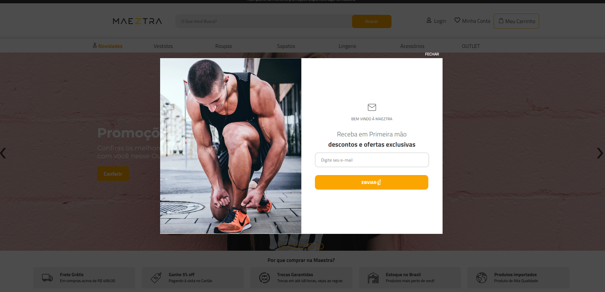
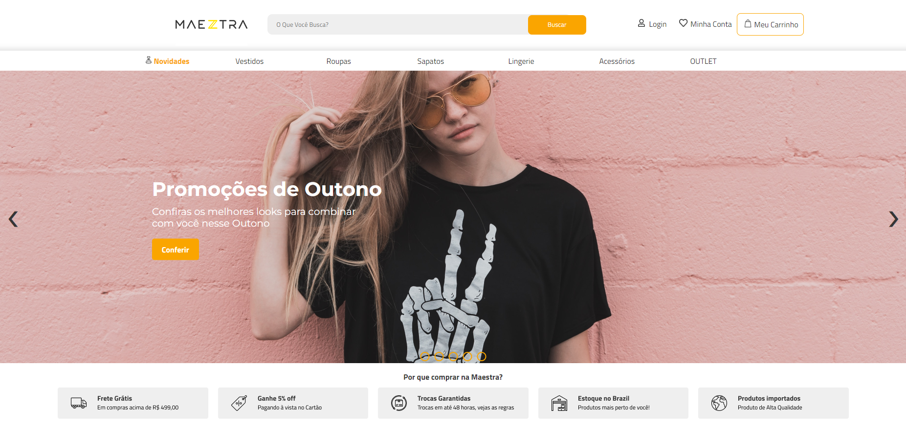
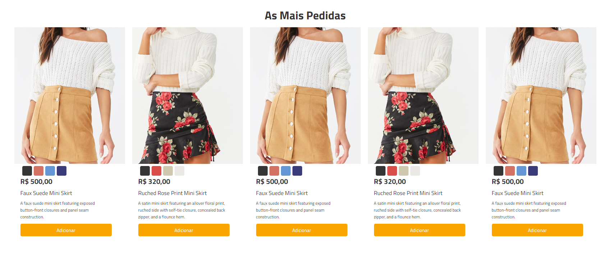
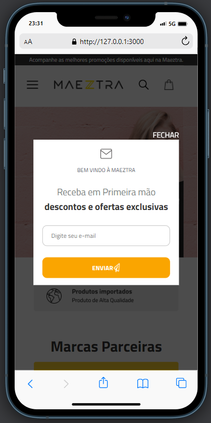
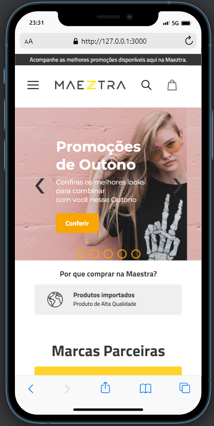
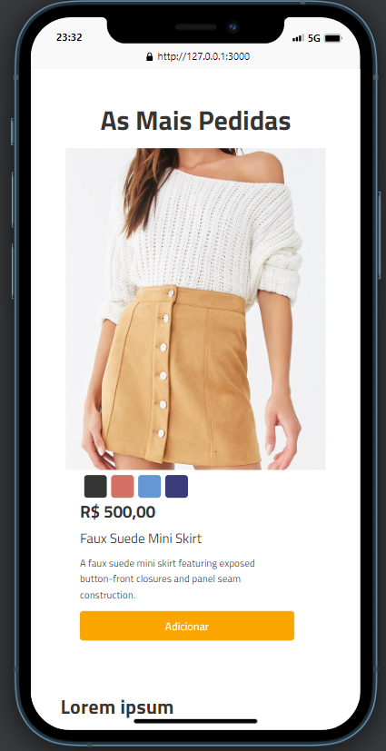

# Desafio Maeztra - Teste Lógico e Teste de Layout
 
### TESTE DE LÓGICA
Foram passadas 5 questões de JavaScript.
Indo na pasta **Questoes_JS** você vai encontrar as soluções e as explicações que fiz *(// em comentários )* relacionadas as questões enviadas no respositório de [GitHub Maeztra](https://github.com/maeztra/desafio-maeztra-dev).

### TESTE DE LAYOUT
Este teste se encontra na pasta chamada **Layout** contendo nela todos os arquivos de HTML, CSS e png *separados por pastas/categorias* que usei para desenvolvê-la.

Neste teste desafio, tive como base a estrutura criada no [Figma Maeztra](https://www.figma.com/file/3RqPfS5PW9whbQNCTTaoqA/%5B2020-09%5D-MZ---Layout-Teste-de-vagas-para-time-de-Devs?type=design&node-id=2-5&mode=design&t=FYaOfV81ir1ubvoq-0). Onde baixei imagens de banners, ícones, logomarcas, peguei o código das cores escolhidas, tamanho de fonte e outros componentes, instalei as fontes de texto para serem usadas e adicionei no arquivo HTML e etc. 

E fiz o responsivo focando de fato no protótipo enviado, de modo estático, sem muita funcionalidade ativa até o momento. 
(Lembrando que não dá para seguir 100% das medidas construídas no Figma, pois pode não ficar ok para algumas telas - dando mais complexidade no momento em que for desenvolver o código responsivo). 

Ah, não posso esquecer no pop-up (ou modal) de Newsletter que aparece ao carregar a tela. Ficou top, né? 

_________________________

### Como faço para abrir o projeto?

1. Baixe o arquivo ZIP;
2. Extraia essa pasta que você acabou de baixar;
3. Dentro da pasta extraída, clique com botão direito e encontre/clique "Abrir com Code" (espero que já tenha baixado o programa *Visual Studio Code*, haha. Ou siga esses passos [CLICANDO AQUI](https://code.visualstudio.com/download));
4. Abrindo o Visual Studio Code você terá acesso as pastas que citei nos techos onde falei do que foi feito nos desafios.
5. Agora é só baixar o app dentro do programa **Live Preview** para visualizar, caso esteja ruim, copie o link que ele disponibiliza e carregue no navegador de sua preferência (Chrome, Opera, Brave e etc);
6. Agora é só testar o layout desktop e mobile.

______________

#### DEMONSTRAÇÃO 

### Desktop

### Mobile

## Considerações finais

Adorei fazer esse desafio. Me fez pesquisar muitas coisinhas que acabei me esquecendo e (re)aprendi algo novo. 
Torçam por mim para que eu seja aprovada. Avaliem com carinho!

Desde já super agradeço a oportunidade, equipe Maeztra.

Um abraço! 🥰

